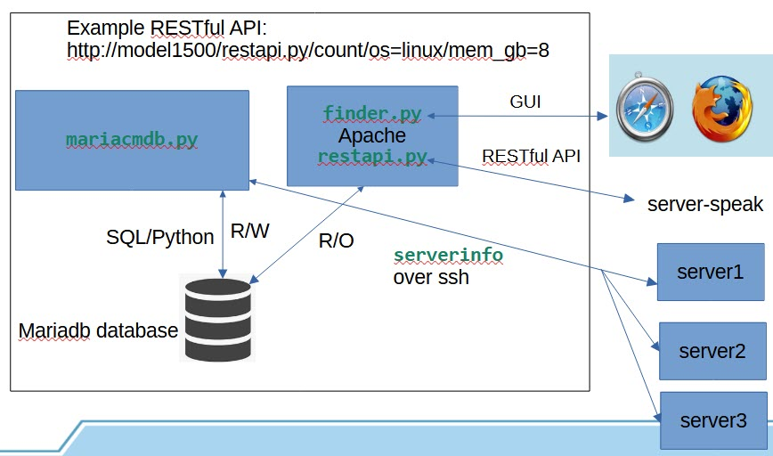

# mariacmdb
A simple Configuration Management Database (CMDB) that uses mariadb to store the data

# Overview
It has the following files:
- ``mariacmdb.py``&nbsp;&nbsp;&nbsp;&nbsp; Line command that maintains the database
- ``restapi.py``&nbsp;&nbsp;&nbsp;&nbsp;&nbsp;&nbsp;&nbsp;&nbsp; RESTful API that works through a Web server
- ``serverinfo``&nbsp;&nbsp;&nbsp;&nbsp;&nbsp;&nbsp;&nbsp;&nbsp; A small bash script that returns data from managed servers

Key-based authentication, or *Passwordless* SSH access is needed for one user from the mariacmdb server to all systems that will be managed. 
The ``mariacmdb.py`` command must be run by that user.

Using mariadb, one database (``cmdb``) is created, and one table (``servers``) is created in that database.

Following is a block diagram.


# Installation
To install MariaDB, perform the following steps:

- Install mariadb, and the Python connector.
```
sudo apt update
sudo apt install mariadb-server libmariadb3 libmariadb-dev
pip3 install mariadb
pip install mysqlx-connector-python
```

- Answer many security questions.
```
sudo mysql_secure_installation
```

Remember the MariaDB root password

- Copy this repository to your home directory.


```
cd
git clone https://github.com/mike99mac/mariacmdb
```

- Copy the line command to a directory in your ``PATH`` and the RESTful API command to a CGI directory of your Web server. 
In this example, Apache set up ``/srv/www/maraicmdb/`` as a CGI directory. 

```
cp ~/mariacmdb/usr/local/sbin/mariacmdb /usr/local/sbin
cp ~/mariacmdb/srv/www/restapi.py /srv/www/mariacmdb
```

- Copy the ``serverinfo`` bash script to your home directory.  
If you pass the ``-c`` flag to ``mariacmdb.py``, it will expect the script to be there and will *push* it to the managed server before running it.

```
cp ~/mariacmdb/usr/local/sbin/serverinfo ~
```

Installation and configuration of Apache is beyond the scope of this document, however, following is the Apache configuration file that is being used:

```
#
# Mariacmdb configuration file
#
User pi
Group pi
<VirtualHost *:80>
  ServerAdmin mmacisaac@example.com 
  DocumentRoot /srv/www/mariacmdb
  ServerName model1500
  LogLevel error
  LoadModule cgi_module /usr/lib/apache2/modules/mod_cgi.so

  <Directory "/srv/www/html">
    Options Indexes FollowSymLinks
    AllowOverride all
    Require all granted
  </Directory>

  <Directory /srv/www/mariacmdb>
    Options +ExecCGI
    DirectoryIndex restapi.py
    Require all granted
  </Directory>
  AddHandler cgi-script .py

  ErrorLog ${APACHE_LOG_DIR}/error.log
  CustomLog ${APACHE_LOG_DIR}/access.log combined
```

# Usage
This mariacmdb solution was designed to be very easy to use.

## Line command
Following is the help output for ``mariacmdb.py``:

```
$ mariacmdb.py -h
usage: mariacmdb.py [-h] [-v] [-c] [--column COLUMN] [--value VALUE] [--pattern PATTERN] [--server SERVER] command

mariacmdb - A simple Configuration Management Database

positional arguments:
  command            Can be 'add', 'describe', 'initialize', 'query', or 'remove'

options:
  -h, --help         show this help message and exit
  -v, --verbose      increase output verbosity
  -c, --copyscript   copy script 'serverinfo' to target server before add
  --column COLUMN    column name to search
  --value VALUE      value to search for in previous column
  --pattern PATTERN  pattern for query all columns
  --server SERVER    server to add or remove
```

Following is an example of initializing the database, adding four servers and showing a query:

```
mariacmdb.py initialize
Created database 'servers'

mariacmdb.py describe 
Table servers:
Field,Type,Null,Key,Default,Extra
---------------------------------
host_name,varchar(255),NO,PRI,None,
ip_addr,varchar(20),YES,,None,
cpus,int(11),YES,,None,
mem_gb,int(11),YES,,None,
arch,varchar(50),YES,,None,
os,varchar(100),YES,,None,
os_ver,varchar(50),YES,,None,
kernel,varchar(100),YES,,None,
rootfs,int(11),YES,,None,
created_at,timestamp,NO,,current_timestamp(),

mariacmdb.py add --server model800
Added or updated server model800

mariacmdb.py add --server model1000
Added or updated server model1000

mariacmdb.py add --server model1500
Added or updated server model1500

mariacmdb.py add --server model2000
Added or updated server model12000

mariacmdb.py query 
model1000,192.168.12.233,4,4,aarch64,Linux,Debian GNU/Linux 12 (bookworm),6.6.28+rpt-rpi-v8 #1 SMP PREEMPT Debian 1:6.6.28-1+rpt1 (2024-04-22),29,2024-05-06 14:01:22
model1500,192.168.12.239,4,4,aarch64,Linux,Ubuntu 22.04.4 LTS,5.15.0-1053-raspi #56-Ubuntu SMP PREEMPT Mon Apr 15 18:50:10 UTC 2024,24,2024-05-06 14:02:01
model2000,192.168.12.163,4,8,aarch64,Linux,Debian GNU/Linux 12 (bookworm),6.6.28+rpt-rpi-2712 #1 SMP PREEMPT Debian 1:6.6.28-1+rpt1 (2024-04-22),32,2024-05-06 14:02:06
model800,192.168.12.176,4,4,aarch64,Linux,Ubuntu 22.04.4 LTS,5.15.0-1053-raspi #56-Ubuntu SMP PREEMPT Mon Apr 15 18:50:10 UTC 2024,23,2024-05-06 14:01:04
```
 
## RESTful API

Following is an example of using the RESTful API to search for servers that have 4 CPUs and 4GB of memory.  Three of the four servers do.

```
curl "http://model1500/restapi.py?cpus=4&mem_gb=4"
<html><head>
</head><body>
<h1>This is the mariacmdb RESTful API!</h1>
<pre>
model1000,192.168.12.233,4,4,aarch64,Linux,Debian GNU/Linux 12 (bookworm),6.6.28+rpt-rpi-v8 #1 SMP PREEMPT Debian 1:6.6.28-1+rpt1 (2024-04-22),29,2024-05-06 14:01:22
model1500,192.168.12.239,4,4,aarch64,Linux,Ubuntu 22.04.4 LTS,5.15.0-1053-raspi #56-Ubuntu SMP PREEMPT Mon Apr 15 18:50:10 UTC 2024,24,2024-05-06 14:02:01
model800,192.168.12.176,4,4,aarch64,Linux,Ubuntu 22.04.4 LTS,5.15.0-1053-raspi #56-Ubuntu SMP PREEMPT Mon Apr 15 18:50:10 UTC 2024,23,2024-05-06 14:01:04
</pre>
</body></html>
```

