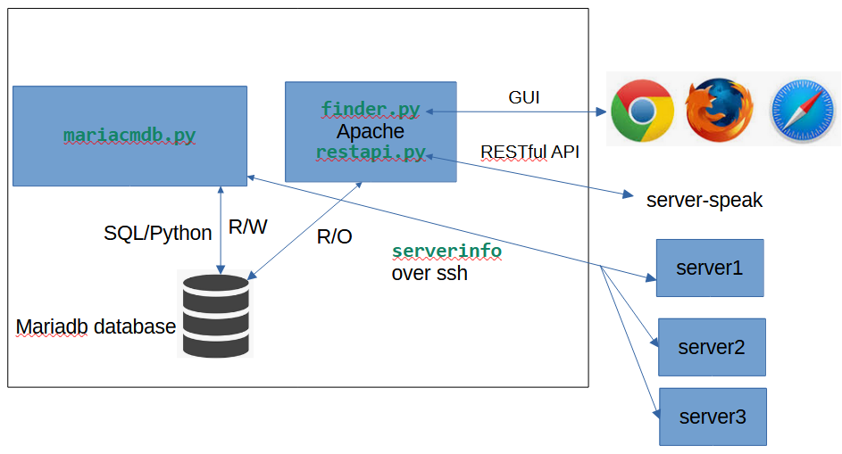
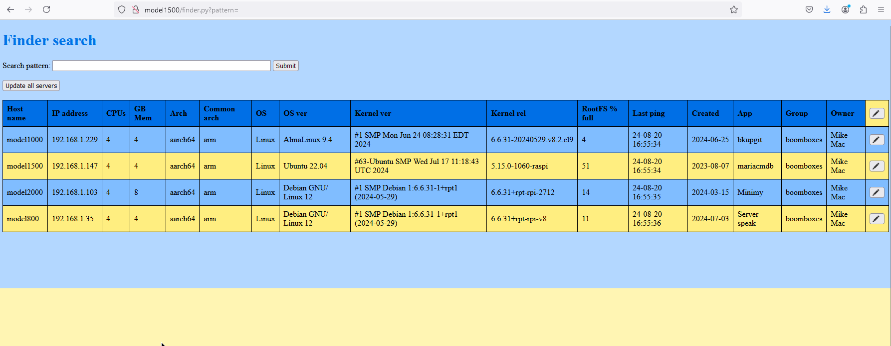
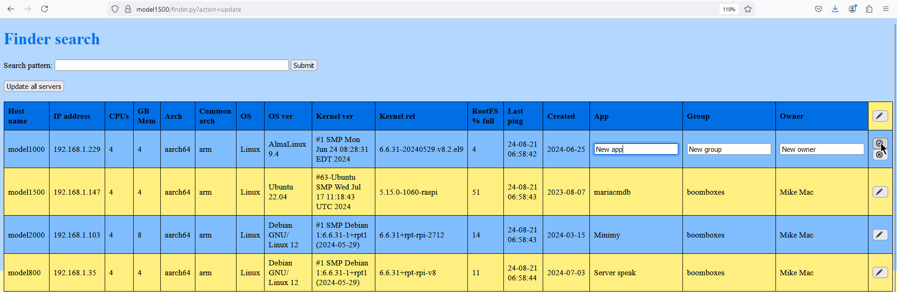

# mariacmdb
This repository contains code to create a simple Configuration Management Database (CMDB). It uses the *mariadb* relational database to store the data. The name *Mariacmdb* is a conflation of *mariadb* and *CMDB*.

It consists of four main components:
- A relational database with data of managed servers
- A Linux line command
- A Web browser interface
- A RESTful API - for example: ``curl "http://model1500/restapi.py?update&model1000&Oracle&Dev&Joe"``


# Overview
Following is a block diagram of Mariacmdb.
 
**Mariacmdb block diagram**

## Source files

There are five main source files:
| File | Language | Description |
| ---- | -------- | ----------- |
| ``bootstable.js`` | Javascript | Code for inline editing of metadata |
| ``mariacmdb.py``  | Python | Line command that maintains the database |
| ``restapi.py``  | Python | RESTful API interfaced through Apache |
| ``finder.py``  | Python | GUI search script with a browser interface |
| ``serverinfo``  | Bash | Return data from managed servers |

Following are the number of lines in the main source files:
```
 Python:
  148 /srv/www/mariacmdb/finder.py
  300 /srv/www/mariacmdb/restapi.py
  443 /usr/local/sbin/mariacmdb.py
  891 total

 Javascript:
  158 /srv/www/mariacmdb/bootstable.js

 Bash:
   48 /usr/local/sbin/serverinfo
   27 /usr/local/sbin/testrestapi
   75 total

 CSS:
   29 /srv/www/mariacmdb/finder.css
 ----
 1153 total
```

## Set up SSH access
Key-based authentication, or *Passwordless* SSH access is needed for one user from the mariacmdb server to all systems that will be managed.
``mariacmdb.py`` commands must be run by that user and they must have ``sudo`` access.

Following is an example of a script that SSH's to each managed server and runs the ``hostname`` command:

```
$ sshall
SSHing to model800 ...
model800
-----------------------------------------
SSHing to model1000 ...
model1000
-----------------------------------------
SSHing to model1500 ...
model1500
-----------------------------------------
SSHing to model2000 ...
model2000
-----------------------------------------
4 of 4 SSHed
```

Here is ``sshall``: https://github.com/mike99mac/mariacmdb/blob/main/usr/local/sbin/sshall

Try to set this up first, then the following instructions can be followed. 

# Installation
These steps set up a virtual environment under ``/srv/venv``. The python files reference this directory. 

This code has been installed on Debian and RHEL bases Linuxes.  When there are differences, separate steps are given for each.

To install mariacmdb, perform the following steps.

- Login as a non-root user with sudo privileges. Add the group which will be running apache to that user.  

```
sudo usermod -aG apache mikemac
su - mikemac
id
uid=1000(mikemac) gid=1000(mikemac) groups=1000(mikemac),48(apache)
```

- Update your system.

  - For Debian-based:
    ```
    sudo apt update 
    ```

    ```
    sudo apt upgrade -y
    ```

  - For RHEL-based:
    ```
    sudo dnf update 
    ```

- Install co-requisite packages.

  - For Debian-based:
    ```
    sudo apt install cifs-utils curl gcc git  make mlocate net-tools pandoc python3 python3-dev python3-pip 
    ```

  - For RHEL-based:
    ```
    sudo dnf install bzip2-devel cifs-utils curl gcc git libffi-devel make mariadb-connector-c-devel mlocate net-tools openssl-devel pandoc python3 python3-devel python3-pip vim wget zlib-devel
    ```

- Install Apache.

  - For Debian-based:
    ```
    sudo apt install apache2
    ```

  - For RHEL-based:
    ```
    sudo dnf install httpd
    ```

- Set Apache to start at boot time: 

  - For Debian-based:
    ```
    sudo systemctl enable apache2
    ```

  - For RHEL-based:

    ```
    sudo systemctl enable httpd
    ```

- Install Mariadb, Apache and some co-requisite packages:

  - For Debian-based:

    ```
    sudo apt install mariadb-server libmariadb3 libmariadb-dev 
    ```

  - For RHEL-based:

    ```
    sudo dnf install mariadb-server
    ```

- Create a directory for mariadb to log to:

```
sudo mkdir /var/log/mariadb
```

- Change the group of that directory to the group that Apache runs as.
 
  - For Debian based:
    ```
    sudo chgrp apache /var/log/mariadb
    ```

  - For RHEL based:
    ```
    sudo chgrp www-data /var/log/mariadb
    ```

- Set the group write bit of the new directory:

```
sudo chmod g+w /var/log/mariadb
```

- Set mariadb to start at boot time:

```
sudo systemctl enable mariadb
```

- Start mariadb.

```
sudo systemctl start mariadb
```

- Set the mariadb root password. This must be the same user and password as in ``/etc/mariadb.conf``. Enter the MariaDB command-line tool:

```
sudo mariadb
```

- From there, change the root password, then leave the session: 

```
ALTER USER 'root'@'localhost' IDENTIFIED BY 'new_password';
exit
```

- Change to the ``/srv`` directory:

```
cd /srv
```

## Upgrade Python

This step is optional.  Python must be at level 3.10 or greater because mariacmdb code uses ``match/case`` statements. AlmaLinux 9.4 ships with a base Python version of 3.9.  

To install Python 3.11, perform the following steps.

- Install Python 3.11

```
sudo dnf install python3.11
```

- Show the new version:

```
python3.11 -V
Python 3.11.7
```

## Create a virtual environment
Now that the co-requisites are satisfied, the virtual environment can be created with the following steps: 

- Change to the ``/srv/`` directory: 

```
cd /srv
```

- Create a virtual environment in one of two ways: 
  - where the base Python version is 3.10 or greater: 

    ```
    sudo python3 -m venv venv
    ```

  - Where another Python version was added: 

    ```
    sudo python3.11 -m venv venv
    ```

- Change the group to that which will be running Apache, and add group write permission to ``/`` and ``/srv/``.

  - For Debian-based:
    ```
    sudo chgrp www-data / /srv
    ```

  - For RHEL-based:
    ```
    sudo chgrp apache / /srv
    ```

- Add group write permission to ``/`` and ``/srv``.

```
sudo chmod g+w / /srv
```

- Recursively change the group of the new virtual environment.

  - For Debian-based:
    ```
    sudo chgrp -R www-data venv
    ```

  - For RHEL-based:
    ```
    sudo chgrp -R apache venv
    ```

- Recursively add group write permissions to the new virtual environment:

```
sudo chmod -R g+w venv
```

- Activate the environment which the current user will now be able to write to with group privileges:

```
. venv/bin/activate  
```

You should see the text ``(venv)`` prefixed on the command prompt.

- Upgrade pip:

```
/srv/venv/bin/python3 -m pip install --upgrade pip
```

- Install Mariadb, the Python connector and the tabulate package:

```
python3 -m pip install mariadb mysql-connector-python tabulate
```

- Issue the following command and answer the many security questions:
```
mysql_secure_installation
```

- Clone this repo to your home directory:

```
cd;
git clone https://github.com/mike99mac/mariacmdb
```

- Copy the line command to ``/usr/local/sbin``


```
sudo cp $HOME/mariacmdb/usr/local/sbin/mariacmdb.py /usr/local/sbin
```

- Copy all CGI files to a new directory ``/srv/www/maraicmdb/``. 

```
sudo cp -a ~/mariacmdb/srv/www/mariacmdb /srv/www
```

- Copy the ``serverinfo`` script to your home directory.  When the ``-C`` flag is included on ``mariacmdb.py add`` command, it will first copy the script to the managed server before running it remotely.

```
cp ~/mariacmdb/usr/local/sbin/serverinfo $HOME 
```

- Following is an Apache configuration file for a Debian-based Linux:

```
# cat /etc/apache2/sites-available/mariacmdb.conf
```

```
#
# Mariacmdb configuration file
#
User pi
Group pi
<VirtualHost *:80>
  ServerAdmin mmacisaac@example.com 
  DocumentRoot /srv/www/mariacmdb
  ServerName model1500
  LogLevel error
  LoadModule cgi_module /usr/lib/apache2/modules/mod_cgi.so

  <Directory "/srv/www/html">
    Options Indexes FollowSymLinks
    AllowOverride all
    Require all granted
  </Directory>

  <Directory /srv/www/mariacmdb>
    Options +ExecCGI
    DirectoryIndex restapi.py
    Require all granted
  </Directory>
  AddHandler cgi-script .py

  ErrorLog ${APACHE_LOG_DIR}/error.log
  CustomLog ${APACHE_LOG_DIR}/access.log combined
</VirtualHost>
```

- Following is an Apache configuration file for a RHEL-based Linux: 

```
# cat /etc/httpd/conf/httpd.conf
```

```
#
# Apache configuration file for mariacmdb
#
LoadModule access_compat_module /usr/lib64/httpd/modules/mod_access_compat.so
LoadModule alias_module         /usr/lib64/httpd/modules/mod_alias.so
LoadModule authz_core_module    /usr/lib64/httpd/modules/mod_authz_core.so
LoadModule cgi_module           /usr/lib64/httpd/modules/mod_cgi.so
LoadModule dir_module           /usr/lib64/httpd/modules/mod_dir.so
LoadModule mime_module          /usr/lib64/httpd/modules/mod_mime.so
LoadModule log_config_module    /usr/lib64/httpd/modules/mod_log_config.so
LoadModule mpm_prefork_module   /usr/lib64/httpd/modules/mod_mpm_prefork.so
LoadModule unixd_module         /usr/lib64/httpd/modules/mod_unixd.so
User apache
Group apache
ServerName mmac01
Listen *:80
ServerAdmin mmacisaac@sinenomine.net
DocumentRoot /srv/www/mariacmdb
LogLevel error

<Directory "/srv/www/html">
  Options Indexes FollowSymLinks
  AllowOverride all
  Require all granted
</Directory>

AddHandler cgi-script .py
Alias /mariacmdb /srv/www/mariacmdb
<Directory /srv/www/mariacmdb>
  Options +ExecCGI
# DirectoryIndex restapi.py
  Require all granted
</Directory>

ErrorLog /var/log/httpd/error.log
CustomLog /var/log/httpd/access.log combined
```

- Enable the site for Debian-based Linuxes:

```
sudo a2ensite mariacmdb.conf
```

- Following is the systemd ``service`` file. 

```
cat /etc/systemd/system/apache2.service
```

```
[Unit]
Description=The Apache HTTP Server
After=network.target remote-fs.target nss-lookup.target
Documentation=https://httpd.apache.org/docs/2.4/

[Service]
Type=forking
Environment=APACHE_STARTED_BY_SYSTEMD=true
ExecStartPre=/usr/local/sbin/mklogdir
ExecStart=/usr/sbin/apachectl start
ExecStop=/usr/sbin/apachectl graceful-stop
ExecReload=/usr/sbin/apachectl graceful
KillMode=mixed
PrivateTmp=true
Restart=on-abort

[Install]
WantedBy=multi-user.target
```

- Set Apache to start at boot time and start it in the current environment. 

  - For Debian-based:

    ```
    sudo systemctl enable apache2
    ```

    ```
    sudo systemctl start apache2
    ```

  - For RHEL-based:

    ```
    sudo systemctl enable apache2
    ```

    ```
    sudo systemctl start apache2
    ```

## Create a configuration file
The mariacmdb configuration file allows you to set local values such as the database credentials, the home directory and the logging level.

There is a sample configuration file named ``mariacmdb.conf`` in the repo.  The code expects it to be in ``/etc/``.

- Copy it to ``/etc/``:

```
sudo cp ~/mariacmdb/mariacmdb.conf /etc
```

- Modify the values if desired. Set the root password to the value used earlier in mariadb.

```
sudo vi /etc/mariacmdb.conf
{
  "DBuser": "root",
  "DBpw": "pi",
  "DBhost": "127.0.0.1",
  "DBname": "cmdb",
  "homeDir": "/home/pi",
  "logLevel": "debug"
}
```
- The first four variables are the database user, password, host name or IP address, and the database name which will store the table ``servers``.
- ``homeDir`` is the directory where the ``serverinfo`` script will be copied to and run from.
- ``logLevel``, in order of severity, are ``DEBUG``, ``INFO``, ``WARNING``, ``ERROR`` and ``CRITICAL``.


# Using mariacmdb
The following sections describe the line command, the Web interface and the RESTful API.

## The mariacmdb.py line command
The ``mariacmdb.py`` line command must include one *subcommand*: 

- ``add       `` Add a server to be managed - if it already exists, it will be updated.  
- ``describe  `` Show the metadata of the ``servers`` table.
- ``init      `` Create the ``servers`` table. 
- ``query     `` Show the specified rows of the ``servers`` table.
- ``remove    `` Remove a managed server.
- ``update    `` Update all rows in table.

Following is the help output for ``mariacmdb.py``:

```
mariacmdb.py -h
usage: mariacmdb.py [-h] [-v] [-C] [-c COLUMN] [-p PATTERN] [-s SERVER] subcommand

mariacmdb - A simple Configuration Management Database

positional arguments:
  subcommand            Can be 'add', 'describe', 'init', 'query', 'remove' or 'update'

options:
  -h, --help            show this help message and exit
  -v, --verbose         increase output verbosity
  -C, --copyscript      copy script 'serverinfo' to target server before add
  -c COLUMN, --column COLUMN
                        column name to search
  -p PATTERN, --pattern PATTERN
                        pattern to search for
  -s SERVER, --server SERVER
                        server to add or remove
```

- Use the ``init`` subcommand to create the ``servers`` table:

## Creating a database
To create and populate a new database, perform the following steps:

- Create a database with the ``init`` subcommand.  This should create a database and a table in mariacmdb.

``` 
$ mariacmdb.py init
```

- Check that the database was created. Use the ``desc`` subcommand to list the attributes of the ``servers`` table: 

```
Field,Type,Null,Key,Default,Extra
---------------------------------
host_name,varchar(255),NO,PRI,None,
ip_addr,varchar(20),YES,,None,
cpus,int(11),YES,,None,
mem_gb,int(11),YES,,None,
arch,varchar(50),YES,,None,
arch_com,varchar(50),YES,,None,
os,varchar(100),YES,,None,
os_ver,varchar(50),YES,,None,
kern_ver,varchar(100),YES,,None,
kern_rel,varchar(50),YES,,None,
rootfs,int(11),YES,,None,
last_ping,varchar(50),YES,,None,
created,varchar(50),YES,,None,
app,varchar(50),YES,,None,
grp,varchar(50),YES,,None,
owner,varchar(50),YES,,None,
```

- Use the ``add`` subcommand to insert rows into the database.  

The mariacmdb server must be able to **``ssh``** to all servers using key-based authentication.  Following is an example of adding four severs to be managed:
 
```
mariacmdb.py add --server model800
Added or updated server model800

mariacmdb.py add --server model1000
Added or updated server model1000

mariacmdb.py add --server model1500
Added or updated server model1500

mariacmdb.py add --server model2000
Added or updated server model12000
```

- Use the ``query`` subcommand to show all rows in the table:

```
mariacmdb.py query 
model1000,192.168.1.229,4,4,aarch64,arm,Linux,AlmaLinux 9.4,#1 SMP Mon Jun 24 08:28:31 EDT 2024,6.6.31-20240529.v8.2.el9,4,24-08-21 06:58:42,2024-06-25,bkupgit,boomboxes,Mike Mac
model1500,192.168.1.147,4,4,aarch64,arm,Linux,Ubuntu 22.04,#63-Ubuntu SMP Wed Jul 17 11:18:43 UTC 2024,5.15.0-1060-raspi,51,24-08-21 06:58:43,2023-08-07,mariacmdb,boomboxes,Mike Mac
model2000,192.168.1.103,4,8,aarch64,arm,Linux,Debian GNU/Linux 12,#1 SMP Debian 1:6.6.31-1+rpt1 (2024-05-29),6.6.31+rpt-rpi-2712,14,24-08-21 06:58:43,2024-03-15,Minimy,boomboxes,Mike                 Mac
model800,192.168.1.35,4,4,aarch64,arm,Linux,Debian GNU/Linux 12,#1 SMP Debian 1:6.6.31-1+rpt1 (2024-05-29),6.6.31+rpt-rpi-v8,11,24-08-21 06:58:44,2024-07-03,Server speak,boomboxes,Mi                ke Mac
```

- Use the ``update`` subcommand to update all rows in the ``servers`` table.  There must be the ability to use key-based authentication to ``ssh`` to all managed servers. 

```
mariacmdb.py update 
__main__    : INFO     replace_row(): replaced row for server model1000
__main__    : INFO     replace_row(): replaced row for server model1500
__main__    : INFO     replace_row(): replaced row for server model2000
__main__    : INFO     replace_row(): replaced row for server model800
__main__    : INFO     update_cmdb() successfully updated table 'servers'
```
 
## Web interface
Following is a screen shot of the browser interface:


**Finder browser interface**

Hopefully all is intuitive.  There is one search field that will search on any column. Click the ``Submit`` button and a search will be performed, returning all matching servers.

There is an ``Update all servers`` button. This will go out to all managed servers and update the values in real time. It will update the ``Last ping`` column. 

On the right side of each row, there is a pencil icon. Click that to go into edit mode for the three metadata columns: ``app``, ``group`` and ``owner``.  Modify the data and click the check mark to save, or the X to discard changes.  This is shown in the following figure:


**Finder in edit mode**


## RESTful API
Following is an example of using the RESTful API to search for servers that have 4 CPUs and 4GB of memory.  Three of the four servers do.

```
curl "http://model1500/restapi.py?cpus=4&mem_gb=4"
<html><head>
</head><body>
<h1>This is the mariacmdb RESTful API!</h1>
<pre>
model1000,192.168.12.233,4,4,aarch64,Linux,Debian GNU/Linux 12 (bookworm),6.6.28+rpt-rpi-v8 #1 SMP PREEMPT Debian 1:6.6.28-1+rpt1 (2024-04-22),29,2024-05-06 14:01:22
model1500,192.168.12.239,4,4,aarch64,Linux,Ubuntu 22.04.4 LTS,5.15.0-1053-raspi #56-Ubuntu SMP PREEMPT Mon Apr 15 18:50:10 UTC 2024,24,2024-05-06 14:02:01
model800,192.168.12.176,4,4,aarch64,Linux,Ubuntu 22.04.4 LTS,5.15.0-1053-raspi #56-Ubuntu SMP PREEMPT Mon Apr 15 18:50:10 UTC 2024,23,2024-05-06 14:01:04
</pre>
</body></html>
```

